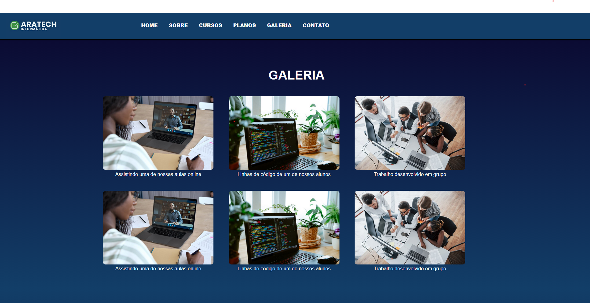
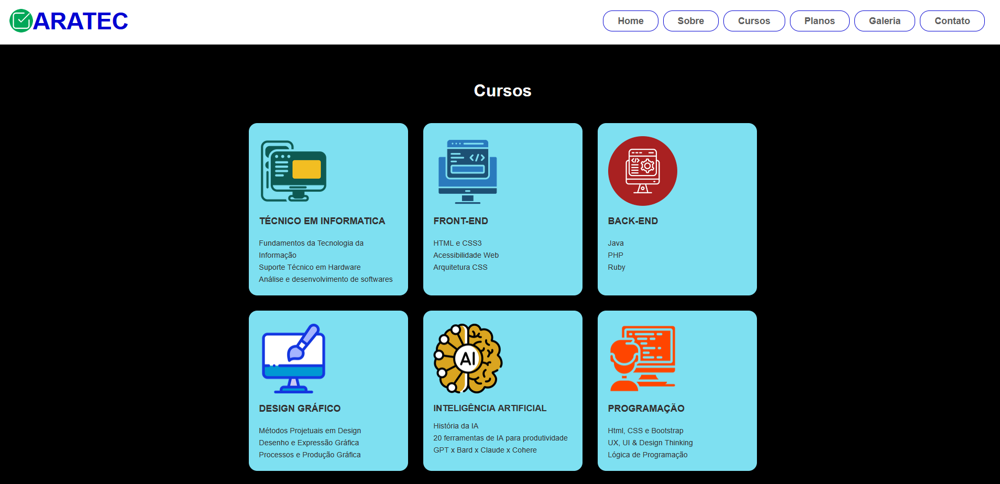
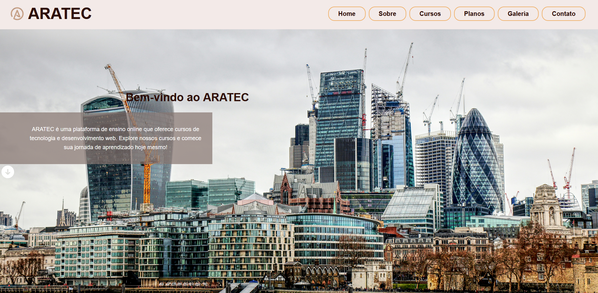
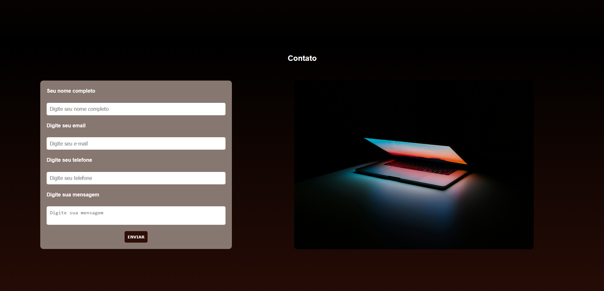

# Estudos-Desenvolvimento-WEB

## 🌐 Repositório de Estudos — Desenvolvimento Web

> 

Bem-vindo ao meu repositório de **estudos de Desenvolvimento Web**! 🚀  
Aqui eu organizo anotações, exercícios, projetos e experimentos feitos durante minha jornada de aprendizado em **HTML, CSS, JavaScript**, frameworks e tecnologias relacionadas ao desenvolvimento front-end e back-end.

Este projeto não possui fins comerciais e foi criado apenas **para fins educacionais**.

---

## 📸 Demonstração

Catálogo de Páginas Aratec Informática:

  

  

- [Aratec Informática modelo](https://landing-page-aratec-informatica-v3.vercel.app/)

  

  

- [Aratec Informática Primeira Versão](https://landing-page-aratec-informatica-v1-six.vercel.app/)

  

  

- [Aratec Informática Versão Final](https://landing-page-aratec-informatica-v1.vercel.app/)

---

## 🚀 Tecnologias

As seguintes ferramentas e tecnologias foram utilizadas na construção do projeto:

#### **Frontend**
- HTML
- CSS

---

## 📝 Licença

Este projeto está sob a licença MIT. Veja o arquivo [LICENSE](LICENSE) para mais detalhes.

---

## 👨‍💻 Autor

Feito por **Clecio Cawan Laurentino Silva**.

